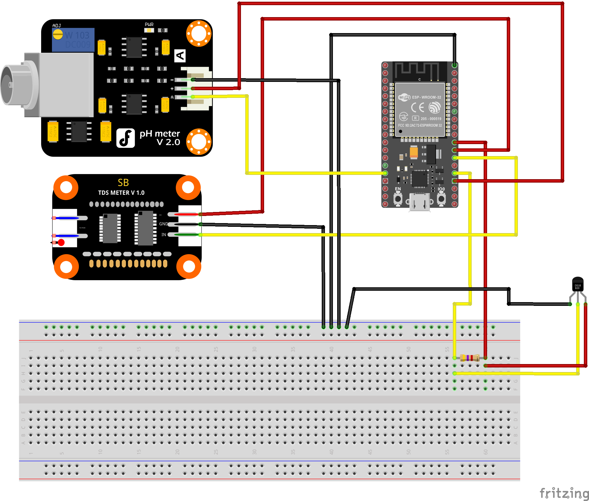
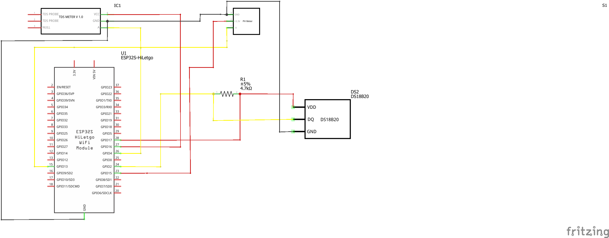
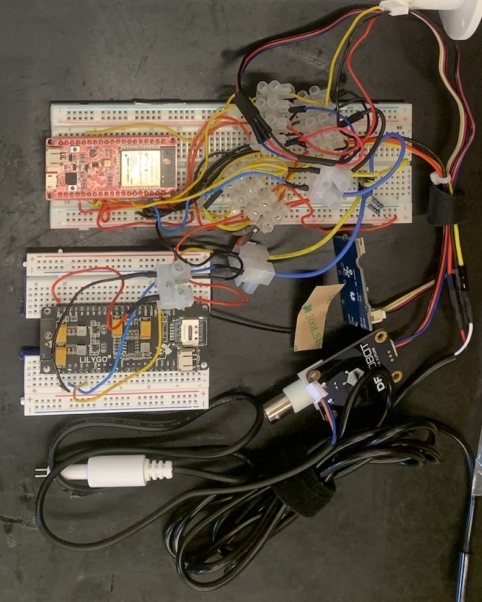

_Readme containing diagram samples -_

This is based on the code for version 2.1. [Code is here.](https://github.com/psword/arduino-ide/tree/main/Water%20Quality%20Measuring%20Project/version%202/2.1)

Breadboard Diagram (LilyGo excluded)

Schematic Example (LilyGo excluded)

Physical Example

