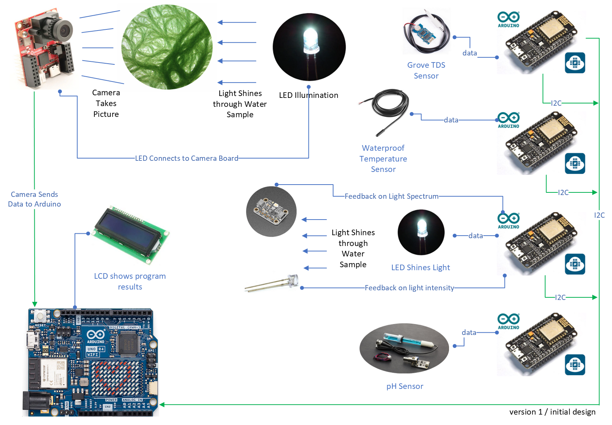
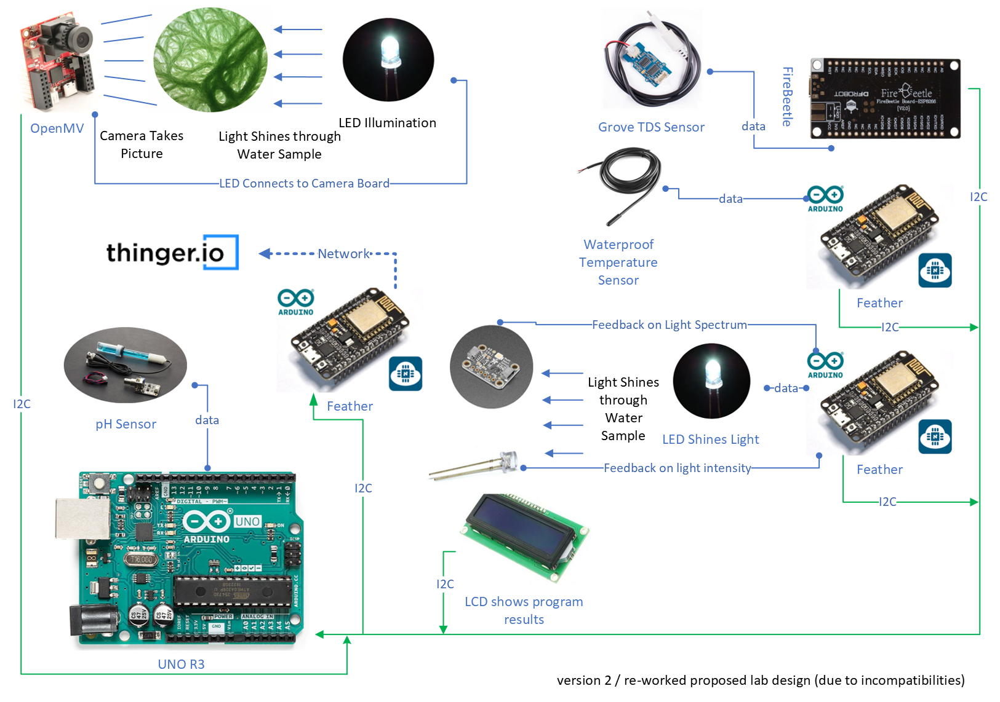

Here are the logical diagrams showing an example of how the system works and was intended to work. The .txt files simply provide a description of the flows of the code structure. The structure was very simple in this case.

This is the original intention for the system. I made some modifications to the design as needed due to limitations between controllers.

This is the actual design that I used to complete the second leg of the project.

