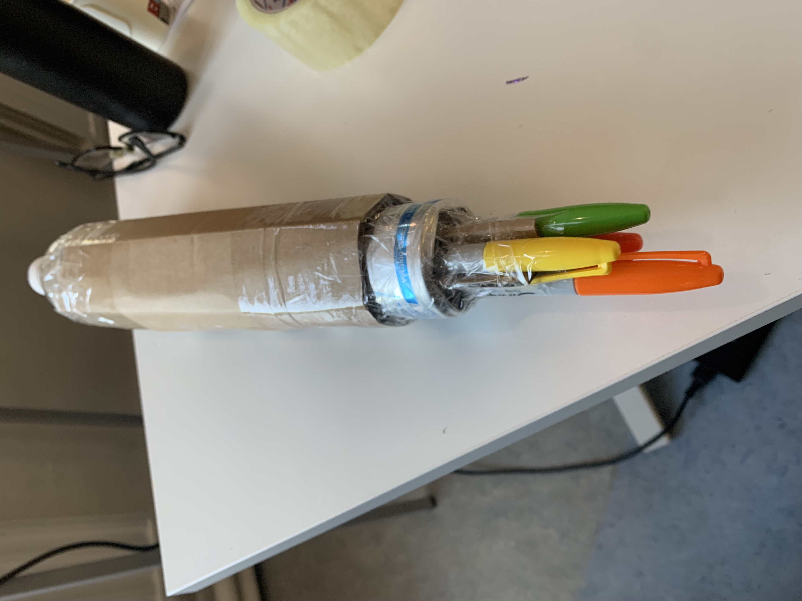
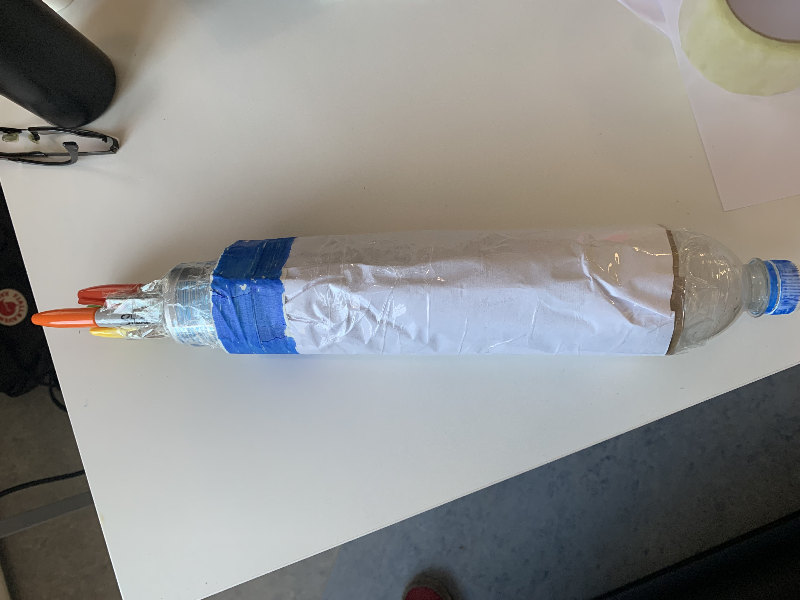
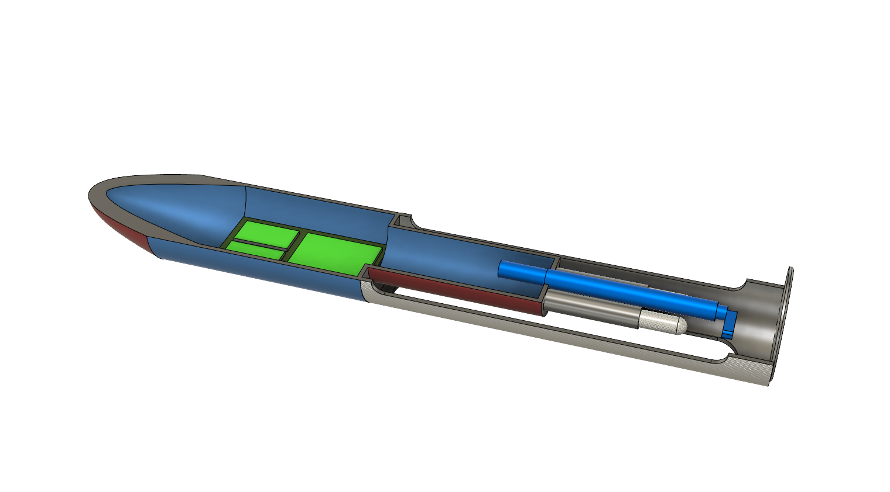
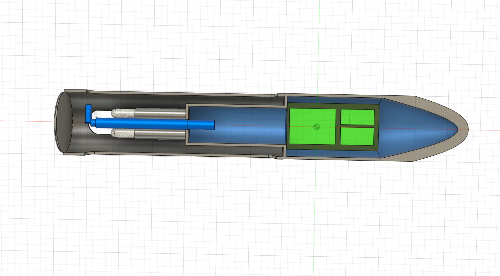
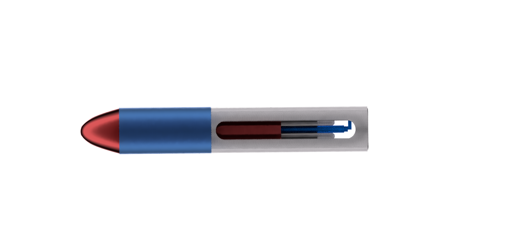
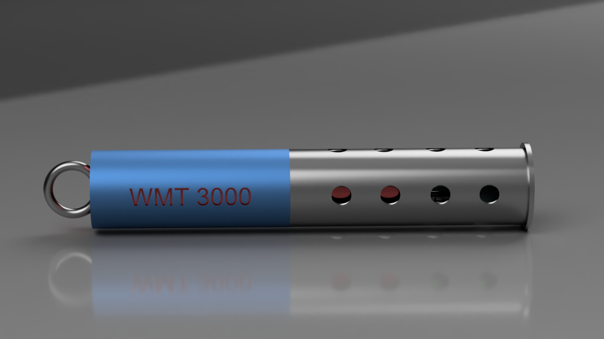

Directory containing photos of ideas. The goal was not to limit imagination but to inspire rapid prototyping and benchmarking. I had also never used

Project Day 1: Cardboard Rendering

Early Project Checkpoint: First Fusion Drawing and Render

Second Project Checkpoint: Second Fusion Drawing and Render

