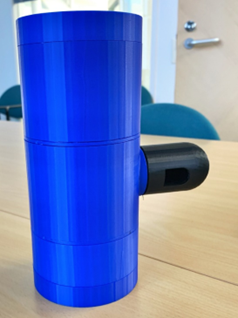
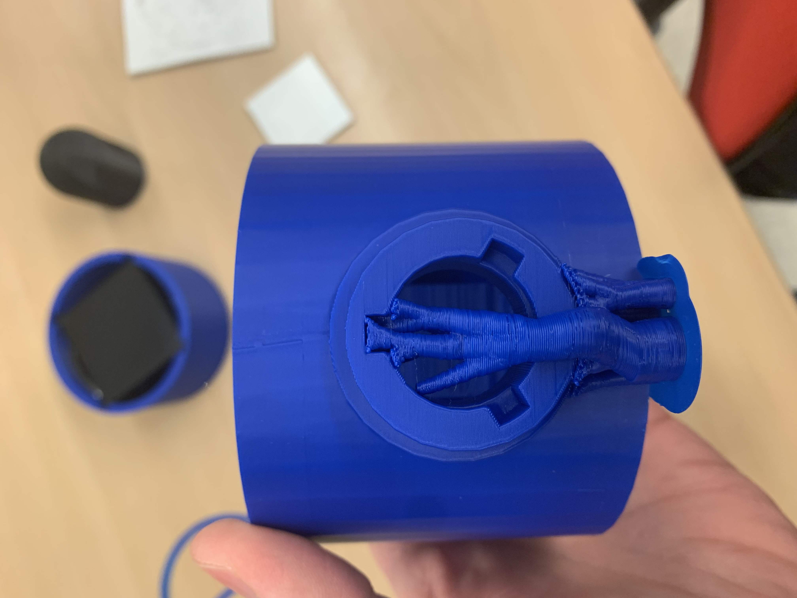
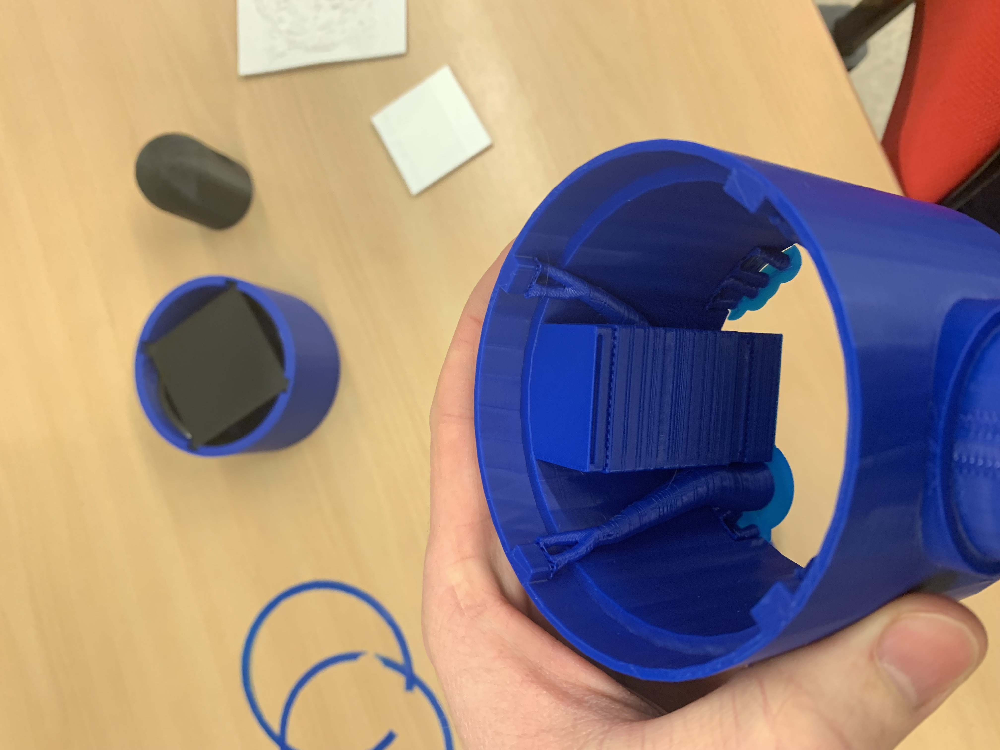
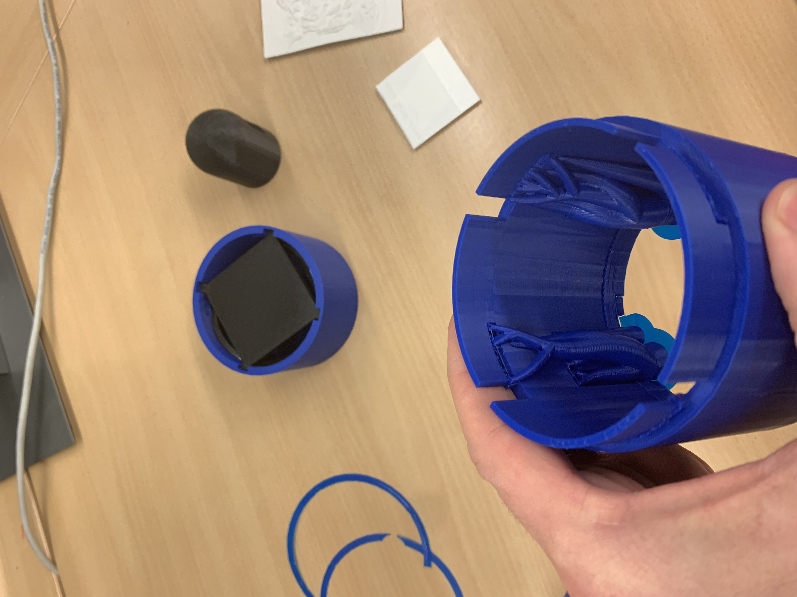
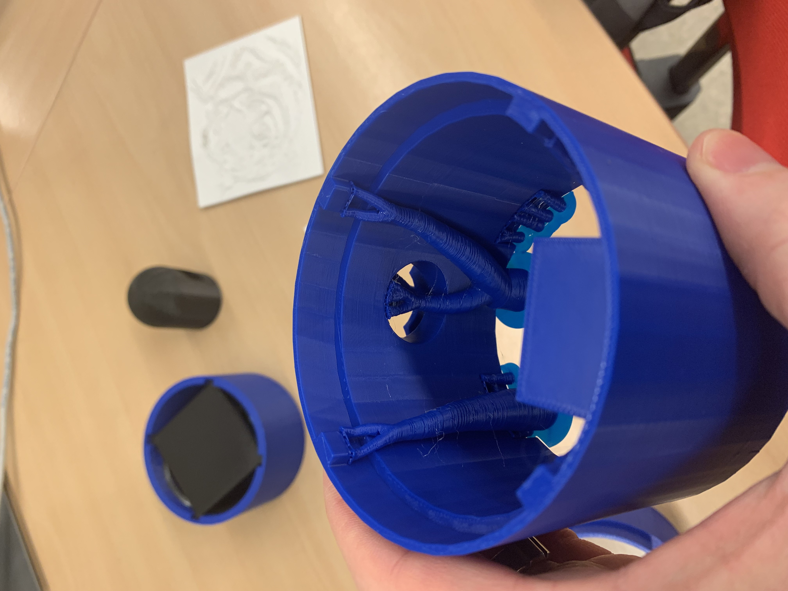
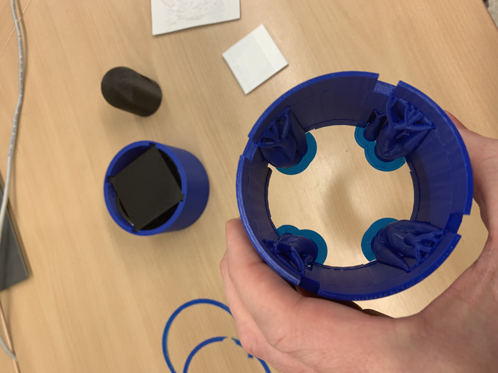
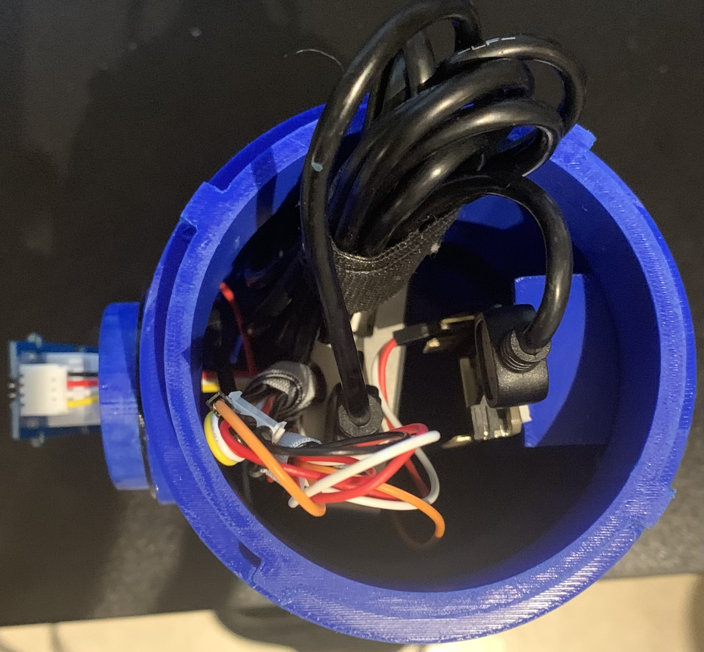
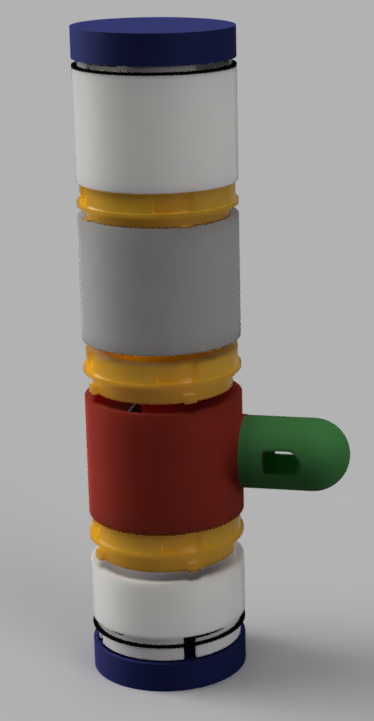
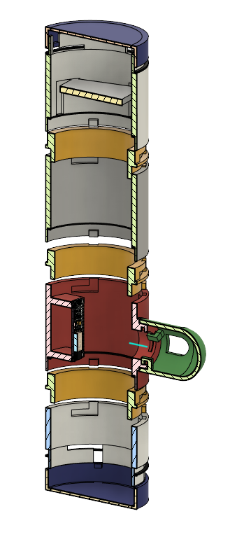

A directory containing photos of the original 3D printed concept. This was among my first attempts at using Autodesk Fusion 360. I tried to imagine what it could look like. I experimented with several interlocking mechanisms with modularity in mind, with none of them suitable for actual use.

This was the model our team submitted as a final product for assessment. There were many other tasks besides simply designing a model. After this initial project leg was complete, our team dissolved due to our separate degree program tracks, and I continued along the same vein.

This model was not intended to be used, but used only as an example.

Assembled 3D printed concept

The parts that were included in the assembly

Example digital drawings

