Directory containing photos of further developed concepts. (fourth iteration)

This version will quickly develop into the prototype that we can deploy. In the photos with the PVC, I assembled it quickly, and I'm guessing it is about a 75% representation of the final result. Again, the focus is not simply on what might work, but also on the iterative design process.

Fully assembled example using PVC pipe - the final version will have 3D printed parts

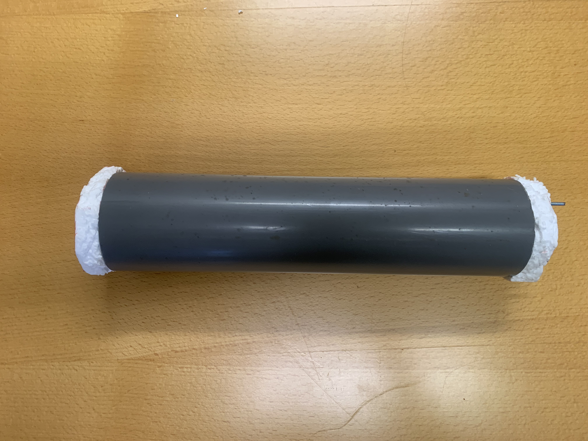

Long view

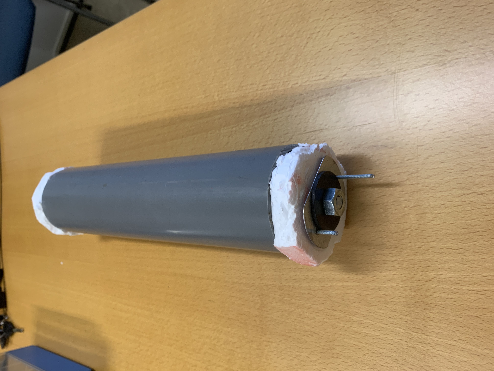

What it may look like with a core

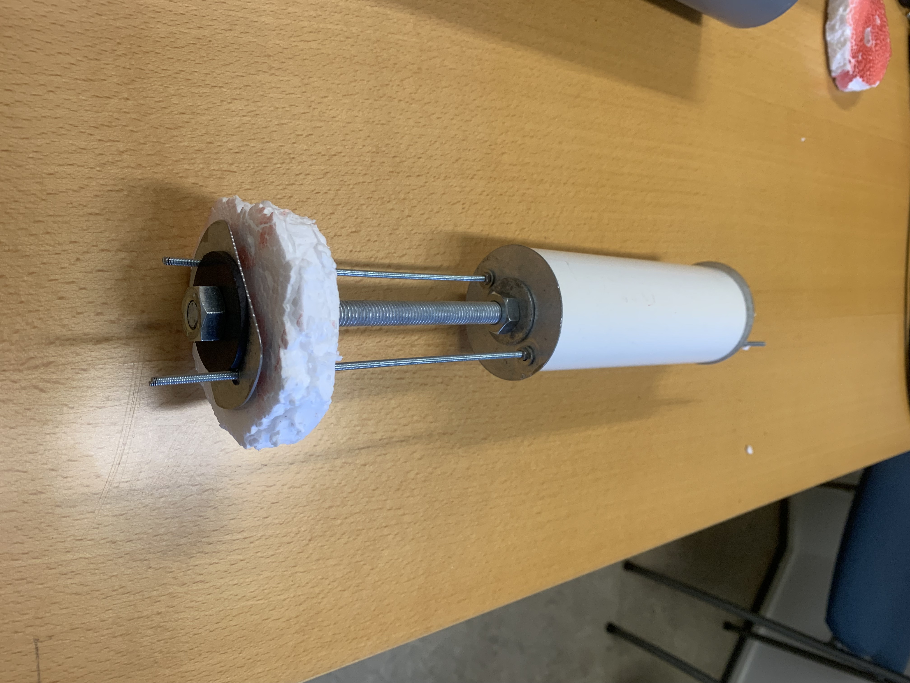

Core reverse view

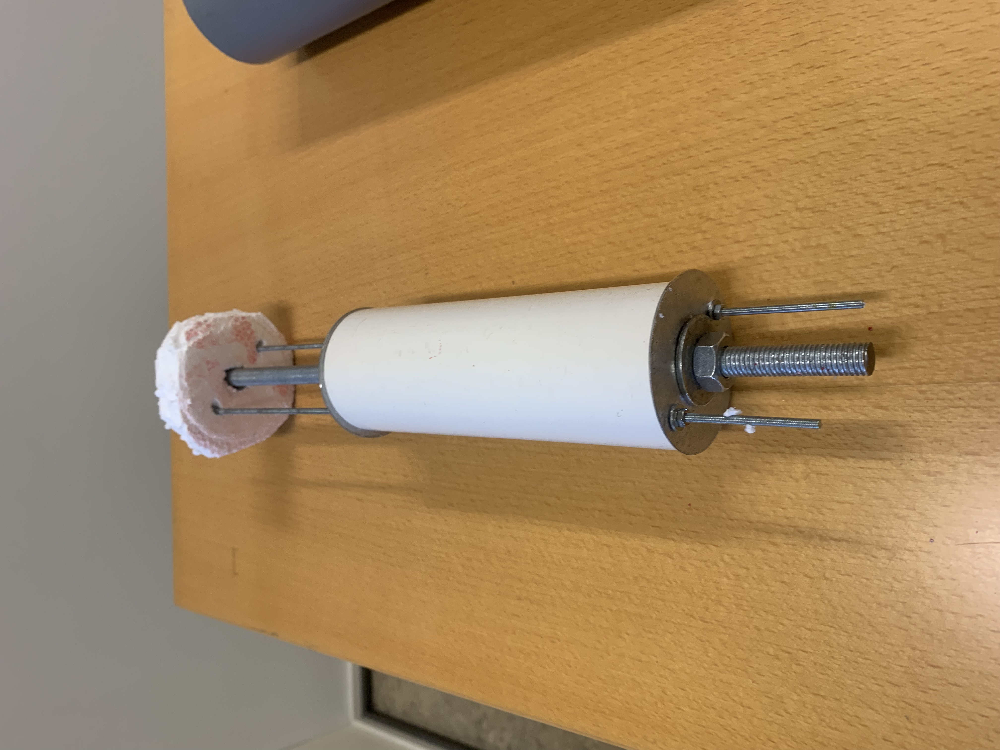

Example assembly

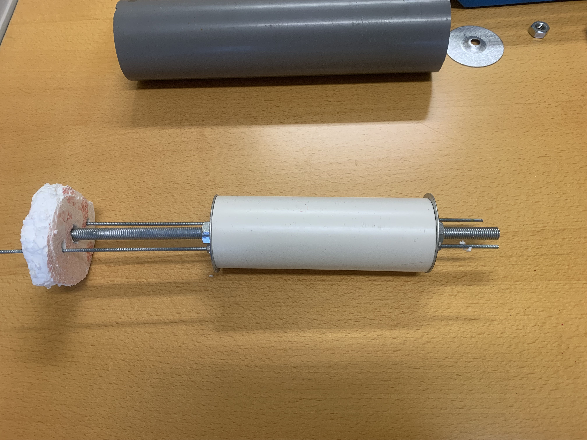

Top view

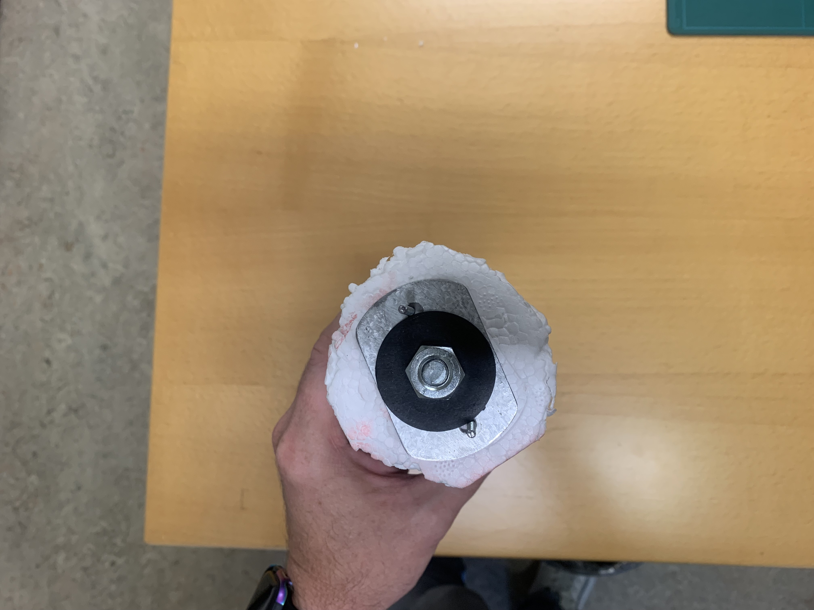

Concept 3D printed fittings and joints (Draft)

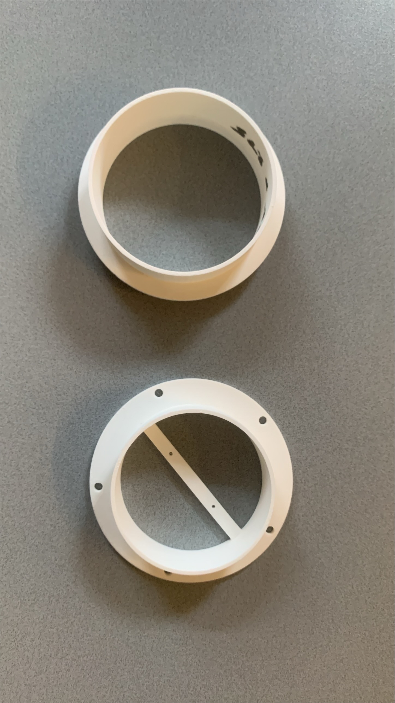

Mount plate and Flange assembly (Draft)

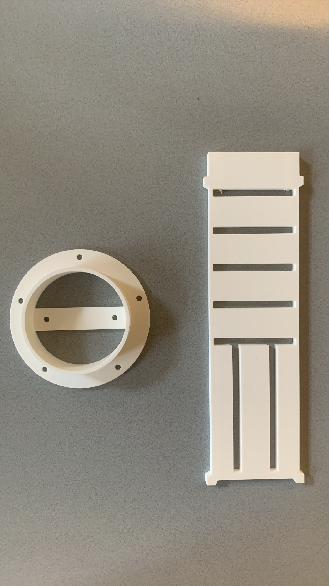

Mount plate example - the plate would be attached to the cross-bar, and the assembly would be inserted into the PVC shell

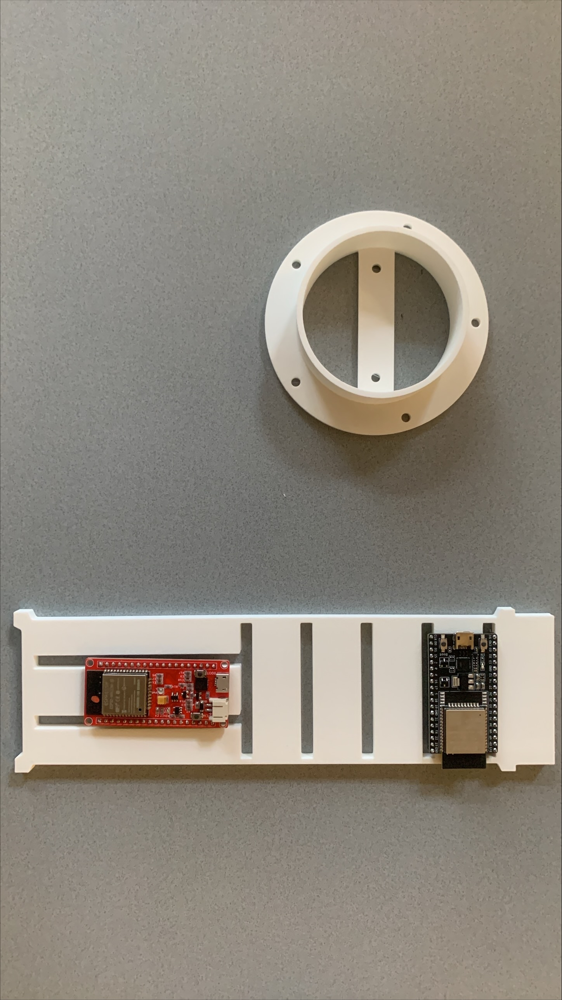

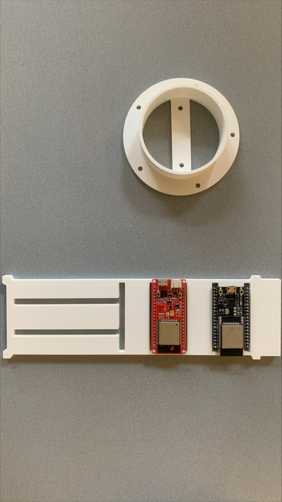

Dimensions Challenge Example - in progress

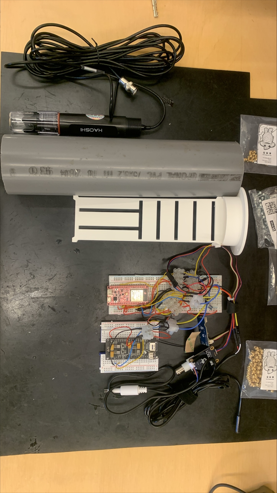
